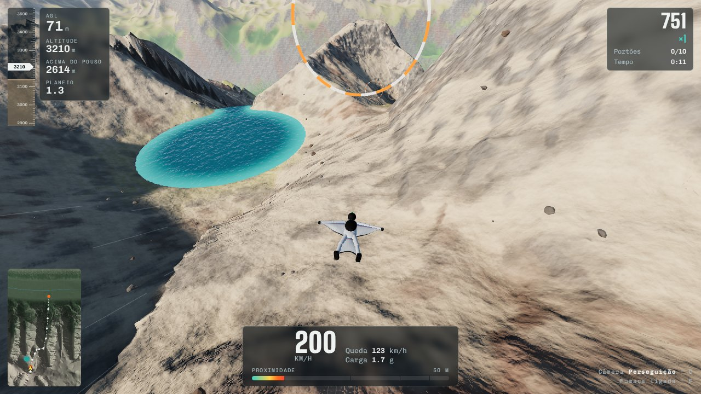

# Emilius — salto BASE de wingsuit em 3D no navegador



Jogo de wingsuit e BASE jump feito só com HTML, CSS e JavaScript ([Three.js](https://threejs.org/)).
Você salta do cume do Monte Emilius (3.559 m, Vale de Aosta), voa colado no relevo passando por 10 portões,
abre o paraquedas acima do vale e tenta pousar no alvo, 2.960 m abaixo da saída.

Inspirado no vídeo [“My Most Breathtaking Wingsuit Flight Ever – Monte Emilius”](https://www.youtube.com/watch?v=i8wRc8LuLxc), do RitschWingsuit.
O relevo é gerado de forma procedural, e não é uma cópia topográfica exata da montanha.

## Jogar

▶️ **[Jogue agora no navegador](https://dliedke.github.io/emilius_wingsuit/src/index.html)**

Ou abra `docs/index.html` num servidor web (veja abaixo) ou publique no seu próprio GitHub Pages.
Funciona em Chrome, Edge, Firefox e Safari recentes (precisa de WebGL 2). No celular também dá para jogar, com controles de toque.

### Publicar no GitHub Pages

1. Suba este repositório para o GitHub.
2. Vá em **Settings → Pages**.
3. Em *Build and deployment*, escolha **Deploy from a branch**, branch `main` e pasta `/docs`.
4. Depois de um ou dois minutos, o jogo fica disponível em `https://SEU-USUARIO.github.io/NOME-DO-REPO/`.

O `docs/index.html` já vem pronto e carrega o Three.js pela CDN do jsDelivr. Não precisa instalar nada para publicar.

## Controles

| Wingsuit | |
|---|---|
| `W` / `↑` | Mergulhar: nariz para baixo, ganha velocidade |
| `S` / `↓` | Planar e fazer flare: troca velocidade por altura |
| `A` / `D` | Inclinar e curvar |
| `Espaço` | Saltar · abrir o paraquedas |

| Paraquedas | |
|---|---|
| `A` / `D` | Freio esquerdo / direito para curvar |
| `S` ou `Espaço` | Flare com os dois freios, a 3–5 m do chão |
| `W` | Tirantes dianteiros: desce mais rápido |

| Geral | |
|---|---|
| `C` | Trocar câmera (perseguição, capacete, drone lateral, cinema) |
| `F` / `M` | Fumaça nos pés / som |
| `P` / `R` | Pausa / recomeçar |
| `H` | Ajuda |

**Gamepad:** analógico esquerdo pilota, A é a ação, B troca a câmera e os gatilhos são os freios.
**Celular:** arraste do lado esquerdo para pilotar e use o botão laranja para a ação.

### Como pontuar

- Voe perto do relevo para somar pontos de proximidade. Ficar perto por alguns segundos sobe o multiplicador.
- Passe pelos 10 portões. A fenda entre as duas torres vale mais.
- Abra o paraquedas na faixa laranja do altímetro. O bipe avisa a hora.
- Pouse no alvo. Sob o paraquedas, o marcador laranja na tela aponta o alvo, e o anel amarelo no chão mostra onde você vai tocar se seguir reto. O anel fica verde quando está em cima do alvo. A fumaça laranja mostra a direção do vento.
- A **assistência de voo** (em Ajustes, ligada por padrão) levanta o nariz antes de uma batida e transforma toques rasantes em "raspadas" que custam pontos em vez de acabar o voo.

## Como funciona

- **Relevo procedural** (`src/terrain-core.js`): ruído com derivadas, fBm erodido, cristas multifractais, vales escavados, a face de saída no cume, o lago, a fenda entre as torres e o campo de pouso. A mesma função roda no Node, nos Web Workers e no jogo.
- **Geração em Web Workers** (`src/10-worldgen.js`): dois campos de altura aninhados (4 m no desktop e 8 m no celular perto do corredor de voo, 40 m no resto), com normais, sombra do sol, oclusão ambiente, mapas de vegetação e posição de árvores pré-calculados.
- **Terreno na GPU** (`src/30-scene.js`, `src/20-shaders.js`): chunks instanciados com 5 níveis de detalhe, geomorphing, saias contra frestas, textura de altura em float, sombreamento triplanar com bump por derivadas, névoa de altura, sombras analíticas do piloto e do velame e depth buffer logarítmico.
- **Física** (`src/50-flight.js`): passo fixo de 120 Hz, aerodinâmica da wingsuit com tabelas de sustentação e arrasto por ângulo de ataque e inclinação, sequência de abertura do paraquedas com choque de abertura, modelo de velame com freios, flare e vento, e detecção de proximidade em 12 direções.
- **Câmeras** (`src/60-camera.js`), **áudio sintetizado com WebAudio** (`src/70-audio.js`), **teclado, toque e gamepad** (`src/80-input.js`).
- **Jogo** (`src/90-game.js`): pontuação, portões, replay gravado, HUD, minimapa, marcador do alvo, resolução adaptativa e ajustes salvos no `localStorage`.

## Estrutura

```
src/            código-fonte (arquivos numerados na ordem em que são concatenados)
  index.html    HTML e CSS da interface; o build injeta o JavaScript em <!--SCRIPT-->
build.js        junta tudo em um único HTML
docs/           versão pronta para o GitHub Pages (gerada pelo build)
tests/          testes visuais com Playwright (capturas de tela e simulação)
tools/          prévia do relevo em PNG, direto no Node
```

## Desenvolvimento

Requisitos: Node 18+ e Python 3 (só para o servidor local e os testes).

```bash
npm install            # baixa o Three.js para o build local
npm run build          # gera docs/index.html (GitHub Pages) e dist/emilius.html
npm run serve          # build local com Three.js offline + servidor em http://localhost:8765/local.html
```

Depois de editar qualquer arquivo em `src/`, rode `npm run build` de novo para atualizar o `docs/index.html`.

### Testes visuais (opcional)

Os scripts em `tests/` abrem o jogo num Chromium headless, pilotam com o piloto automático e salvam capturas de tela.
Eles esperam o servidor local rodando (`npm run serve`) em outro terminal.

```bash
pip install playwright pillow
python -m playwright install chromium
python tests/test_canopy.py saida/          # abertura do paraquedas, câmeras, pouso e replay
python tests/test_target.py saida/          # visibilidade do alvo sob o paraquedas
python tests/test_fixed.py                  # voa com comandos fixos e confere se não bate
```

Para ver o relevo de cima sem abrir o navegador:

```bash
node tools/terrain-preview.js               # gera preview.png com o traçado, os portões e o alvo
```

No console do navegador, `window.__emilius` expõe o estado do jogo para depuração (por exemplo, `__emilius.AUTO.on = true` liga o piloto automático).

## Créditos

- Voo original: [RitschWingsuit — Monte Emilius](https://www.youtube.com/watch?v=i8wRc8LuLxc).
- [Three.js](https://threejs.org/) (licença MIT), carregado pela CDN do jsDelivr.
- Fontes: Big Shoulders Display, Barlow Semi Condensed e Chivo Mono, do Google Fonts.
